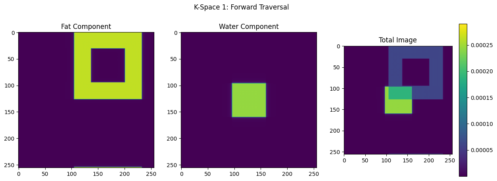
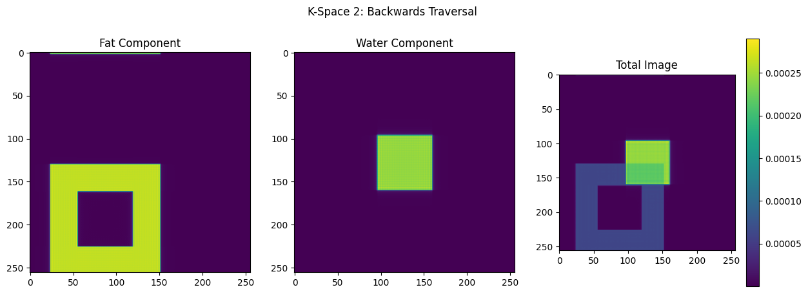
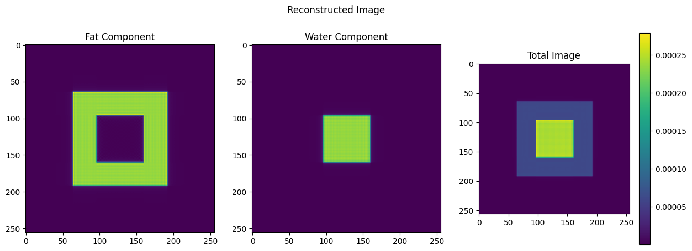

# Preface

This repository explores a post-processing chemical separation technique used in Magnetic Resonance Imaging. Fat-Water Separation for Diffusion-Weighted Echo Planar Imaging (DW-EPI) is carried-out in the notebook below.

The repository also contains methods for generating k-space data via Echo Planar Imaging, and the means by which a sample image may be recovered from a corrupted image, with some delay induced in the spatial frequency domain.

`kspace.py` contains the dataclass `params` which returns an object containing the paramters used to conduct the EPI experiment. An additional dataclass `kspace_data` takes a `params` object as input, and contains methods used to produce k-space data with some random or constant row-dependent delay, and some helper functions to save, load, and plot the k-space data.

`reconstruct.py` contains the dataclass `reconstruct` that takes a `kspace_data` object as input, and contains methods used to remove the delay from the corrupted signal.

`transforms.py` contains functions to perform forward and inverse 1D and 2D fast fourier transforms.

`sample_sim.py` includes a sample experiment in which a uniformly distributed row-dependent delay has been applied to the image in the spatial frequency domain. The original image is then subsequently reconstructed from the corrupted data.

For instance, suppose eddy currents and system delays cause deviations in our target trajectory through k-space. We may assume some random, uniformly distributed delay throughout k-space, i.e.:

```python
delays = 0.05*np.random.uniform(-0.8, 0.8, (256,1))
```
The delay may be applied to the k-space data by generating a `params` object and passing the `params` object as input to the `kspace_data` dataclass:

```python
# params(scaling_factor, voxel_width_factor, pixel_offset, delay, modulo, row_dependent, image_size = 256)
kspace = kspace_data(params(1, 2, 128, delays, 2, True))
```


# Fat-Water Separation

In the domain of Magnetic Resonance Imaging (MRI), the accurate separation of fat and water signals is critically important, primarily due to the distinct chemical shifts they exhibit. This distinction is critical as it directly influences image clarity and diagnostic precision.

The overlapping of fat and water signals can lead to substantial image degradation, especially in anatomical regions where both tissue types coexist, such as the abdominal and breast regions.

Precise fat/water separation is, therefore, a cornerstone in enhancing the diagnostic capabilities of MRI. It allows for more accurate identification of pathologies, particularly those that manifest through alterations in fat or water content within tissues.

In a research context, the ability to differentiate these signals is instrumental in advancing our understanding of various medical conditions and refining MRI techniques. Thus, the development and refinement of methods to address the inherent chemical shift in MRI not only enhances image quality but also significantly contribute to the accuracy and efficacy of medical diagnostics.

A separation and recovery of fat/water components is conducted herein by collecting two complementary EPI sequences while assuming that imaging is occuring in the water's rotating frame of reference.

## Libraries

```python
import numpy as np
import matplotlib.pyplot as plt
```

## Generating K-Space Data

- A simple case is assumed herein; data is obtained from imaging a slice of the sample containing fat and water *only*.

- EPI data acquisition was two-fold in this experiment; (1) traversing forward through K-Space, and (2) traversing backwards through K-Space.
    - i.e. From kx = 0 to 256 and ky = 0 to 256 in the forward traversal experiment, and kx = -256 to 0 and ky = -256 to 0 in the backwards traversal experiment.
    
- It was assumed that imaging was performed in the water's rotating frame of reference; thus, the water in the sample appears stationary, while some delay is induced in the fat.

<b>Variables</b>:
- `image_size` - size of the image in pixels.
- `fat_scalar` - used to control the size of the fat component of the image.
- `water_scalar` - used to control the size of the water component of the image.
- `scaling_factor` - used to scale the fat and water components of the signal based on selection of `fat_scalar` and `water_scalar`.
- `const` - a constant with units `1/s` dependent on the gyromagnetic ratio of protons in water or fat, and the magnetic field strength. In this example, they are assumed to be the same.
- `t` - total imaging time.
- `tx` - a division of time with units `s` dependent on imaging speed.
- `phi` - phase associated with the fat component of the signal in water's rotating frame of reference.

```python
image_size = 256
fat_scalar = 2
water_scalar = 4
scaling_factor = 1/(np.square(image_size/fat_scalar)/np.square(image_size/water_scalar))
const = 1e6
```

<font size="4"><b>`create_kspace_data`</b></font>

- Arrays are allocated in memory to store water and fat K-Space data, including the phase corresponding to fat in water's rotating frame of reference.

- Fat and water K-Spaces are generated iteratively via nested loops; for each point in K-Space, the phase of the fat component of the signal changes in 2-directions.

- The array storing the fat K-Space data is multiplied by a complex exponential as the experiment pertains to imaging within water's rotating frame of reference.

- The phase is stored, and the time variable `t` is updated for time increment `tx`.

- The fat, water, and phase data are then returned as output.


```python
def create_kspace_data(range: range, tx: float) -> np.ndarray:
    water_kspace = np.zeros((image_size, image_size), dtype = complex)
    fat_kspace = np.zeros((image_size, image_size), dtype = complex)
    phi = np.zeros((image_size, image_size))
    t = 0
    for ky in range:
        for kx in range:
            phi_idx = (-1)*t*const
            fat_complex_exp = np.exp(1j*phi_idx, dtype=complex)
            water_kspace[ky,kx] = np.sinc((kx-128)/water_scalar)*np.sinc((ky-128)/water_scalar)
            fat_kspace[ky,kx]=(np.sinc((kx-128)/fat_scalar)*np.sinc((ky-128)/fat_scalar) -
scaling_factor*np.sinc((kx-128)/water_scalar)*np.sinc((ky-128)/water_scalar))*fat_complex_exp
            phi[ky,kx] = phi_idx
            t += tx

    return fat_kspace, water_kspace, phi
```


```python
fat_kspace1, water_kspace1, phi1 = create_kspace_data(range(image_size), 1e-6)
fat_kspace2, water_kspace2, phi2 = create_kspace_data(range(image_size-1, -1, -1), 1e-6)

kspace1 = fat_kspace1 + water_kspace1
kspace2 = fat_kspace2 + water_kspace2
```

## Plotting the Corrupted Image Data

- The sample has been imaged in the water's rotating frame of reference, hence the introduction of some 2D delay to the fat component of the signal which needs to be resolved.

- The water component of the signal appears stationary due to imaging in the water's rotating frame of reference.

- This delay is reversed in each of the two datasets acquired through experimentation due to traversal of K-Space in opposite directions.

- Given that the magnetic properties of fat and water are known, we may perform fat/water separation by solving a system of equations at each point in K-Space.

<font size="4"><b>`inverse_fft`</b></font>

- The inverse fast fourier transform is computed by first shifting the zero-frequency component of `k-space` to the centre of the frequency spectrum.

- The inverse fourier transform is then computed using `np.fft.ifft2`, and the shift is then reversed via `np.fft.ifftshift`.


```python
def inverse_fft(kspace: np.ndarray) -> np.ndarray:
    return np.fft.ifftshift(np.fft.ifft2(np.fft.fftshift(kspace)))
```


```python
def plot_fat_water(fat_img: np.ndarray, water_img: np.ndarray, total_img: np.ndarray, title: str):

    plt.figure(figsize=(15,5))

    plt.subplot(1,3,1)
    plt.imshow(np.abs(fat_img))
    plt.title("Fat Component")

    plt.subplot(1,3,2)
    plt.imshow(np.abs(water_img))
    plt.title("Water Component")

    plt.subplot(1,3,3)
    plt.imshow(np.abs(total_img))
    plt.title("Total Image")
    
    plt.suptitle(title)
    
    plt.colorbar()
    
```


```python
plot_fat_water(inverse_fft(fat_kspace1), inverse_fft(water_kspace1), inverse_fft(kspace1), 'K-Space 1: Forward Traversal')
```


    

    


```python
plot_fat_water(inverse_fft(fat_kspace2), inverse_fft(water_kspace2), inverse_fft(kspace2), 'K-Space 2: Backwards Traversal')
```


    

    


## Performing the Fat-Water Separation

<b>Formulation</b>:

- $x_r$ and $x_i$ - real and imaginary components of K-Space 1

- $y_r$ and $y_i$ - real and imaginary components of K-Space 2

- $w_r$ and $w_i$ - real and imaginary components of the water component of the signal

- $f_r$ and $f_i$ - real and imaginary components of the fat component of the signal

- $\phi_1$ - phase associated with the fat in the water's rotating frame of reference in K-Space 1

- $\phi_2$ - phase associated with the fat in the water's rotating frame of reference in K-Space 2

<br />

The equations for each K-Space may be written as:

<br/>

$$
  \mathbf{KSpace_1}: \ \ \ x_r + jx_i = w_r + jw_i + (cos(\phi_1) + jsin(\phi_1))(f_r + jf_i)\\
$$

$$
  \mathbf{KSpace_2}: \ \ \ y_r + jy_i = w_r + jw_i + (cos(\phi_2) + jsin(\phi_2))(f_r + jf_i)\\
$$

<br/>

It is noted that since the magnetic properties of fat and water are known, $\phi_1$ and $\phi_2$ are known; thus, the cosine and sine of each may be computed:

<br/>

$$
  cos(\phi_1) \rightarrow{} a \
$$

$$
  cos(\phi_2) \rightarrow{} b \
$$

$$
  sin(\phi_1) \rightarrow{} c \
$$

$$
  sin(\phi_2) \rightarrow{} d
$$

<br/>

Isolating for the real and imaginary components of each K-Space:

<br/>

$$\mathbf{KSpace_1:}$$

$$
  x_r = w_r + af_r - cf_i\\
$$

$$
  x_i = w_i + cf_r + af_i\\
$$

<br/>

$$\mathbf{KSpace_2:}$$

$$
  y_r = w_r + bf_r - df_i\\
$$

$$
  y_i = w_i + df_r + bf_i\\
$$

<br/>

Recall that the fat component of the signal was mixed with some complex exponential due to it being imaged within the water's rotating frame of reference. Per Euler's formula, for any real value of $\phi_1$ and $\phi_2$, the complex exponential may be written as:

<br/>

$$
  e^{j\phi_1} = cos(\phi_1) + jsin(\phi_1) \leftrightarrow{} a + jc
$$

$$
  e^{j\phi_2} = cos(\phi_2) + jsin(\phi_2) \leftrightarrow{} b + jd
$$

<br/>

Thus, the set of linear equations may be written in matrix format per the following. It is important to note that $x_r$, $x_i$, $y_r$, and $y_i$ are known values as they represent the real and imaginary components of each point in K-Space 1 and K-Space 2. As such, the set of equations must be  re-arranged such that we may resolve the water and fat components.

<br/>

``` math
  \begin{bmatrix}
  x_r\\
  x_i \\
  y_r\\
  y_i
  \end{bmatrix}
  =
  
  \begin{bmatrix}
  1 & 0 & a & -c \\
  0 & 1 & c & a \\
  1 & 0 & b & -d \\
  0 & 1 & d & b
  \end{bmatrix}
  
  \begin{bmatrix}
  w_r \\
  w_i \\
  f_r \\
  f_i
  \end{bmatrix}
``` 

<br/>

The system of equations may therefore be re-arranged per the following:

<br/>

``` math
  \begin{bmatrix}
  w_r \\
  w_i \\
  f_r \\
  f_i
  \end{bmatrix}
  =
  \begin{bmatrix}
  1 & 0 & a & -c \\
  0 & 1 & c & a \\
  1 & 0 & b & -d \\
  0 & 1 & d & b
  \end{bmatrix}^{-1}
  \begin{bmatrix}
  x_r \\
  x_i \\
  y_r \\
  y_i
  \end{bmatrix}
``` 

<br/>

The solution identified herein assumes the matrix is non-singular and thereby invertible. The system of equations is solved iteratively for each point in K-Space to resolve the fat and water components from the distorted image. As such, $x_r$, $x_i$, $y_r$, $y_i$ and the coefficient matrix represents data for a single point in K-Space; the values of a, b, c, and d vary depending on the position in K-Space.

The inverse of the coefficient matrix is computed through a multiplication of the matrix's adjugate or adjoint by the reciprocal of the absolute value of the matrix's determinant. For instance, given some matrix A:

<br/>

$$
A^{-1} = \frac{adj(A)}{\mid A \mid}
$$

<br/>


<font size="4"><b>`fat_water_separation`</b></font>

- Arrays are allocated in memory to store the fat and water K-Space data recovered from solving the system of equations.

- Coefficients a, b, c, and d corresponding to the sine and cosine of the $\phi_1$ and $\phi_2$ phases are computed.

- The real and imaginary components of each of the K-Spaces is extracted for each point, and the system of equations is the built per the `Formulation` identified in the previous section.

- The system of equations was then solved iteratively for each point in K-Space using `np.linalg.solve`. 

- The solution to the system of equations at each point in K-Space was stored to the `water_kspace_reconstructed` and `fat_kspace_reconstructed` arrays and returned as output.


```python
def fat_water_separation(phi1: float, phi2: float) -> np.ndarray:
    
    fat_kspace_reconstructed = np.zeros((image_size, image_size), dtype = complex)
    water_kspace_reconstructed = np.zeros((image_size, image_size), dtype = complex)

    a = np.cos(phi1)
    b = np.cos(phi2)
    c = np.sin(phi1)
    d = np.sin(phi2)

    for ky in range(image_size):
        for kx in range(image_size):

            x_r = np.real(kspace1[ky, kx])
            x_i = np.imag(kspace1[ky, kx])
            y_r = np.real(kspace2[ky, kx])
            y_i = np.imag(kspace2[ky, kx])

            dependent_variables = np.array([x_r, x_i, y_r, y_i], dtype=np.float64)

            coefficients = np.array([
                [1, 0, a[ky, kx], (-1)*c[ky, kx]],
                [0, 1, c[ky, kx], a[ky, kx]],
                [1, 0, b[ky, kx], (-1)*d[ky, kx]],
                [0, 1, d[ky, kx], b[ky, kx]]], dtype=np.float64)

            w_r, w_i, f_r, f_i = np.linalg.solve(coefficients, dependent_variables)

            water_kspace_reconstructed[ky, kx] = np.array(w_r + (1j)*w_i)
            fat_kspace_reconstructed[ky, kx] = np.array(f_r + (1j)*f_i)

    return water_kspace_reconstructed, fat_kspace_reconstructed
```


```python
water_kspace_reconstructed, fat_kspace_reconstructed = fat_water_separation(phi1, phi2)

kspace_total = water_kspace_reconstructed + fat_kspace_reconstructed
```

It is important to note that the `coefficients` array defined in the `fat_water_separation` function is precisely equivalent to the following matrix identified in the previous section:

<br/>

$$
  \begin{bmatrix}
  1 & 0 & a & -c \\
  0 & 1 & c & a \\
  1 & 0 & b & -d \\
  0 & 1 & d & b
  \end{bmatrix}
$$

## Plotting the Reconstructed Images


```python
plot_fat_water(inverse_fft(fat_kspace_reconstructed), inverse_fft(water_kspace_reconstructed), inverse_fft(kspace_total), 'Reconstructed Image')
```


    

    


## Limitations

The approach identified herein assumes that the composition of the sample is entirely fat and water, which may not always be representative of real-world data. 

For instance, the sample may be composed of a mixture of tissues including fat, water, and air that may impede the ability of this approach to perform the separation or reconstruction. 

Furthermore, there are numerous image artifacts that may be induced via EPI. For instance, T2 decay results in substantial signal loss in the case where data is collected over long periods (i.e. long TE). 

Additionally, magnetic susceptibility differences between various tissues may induce some additional gradient during imaging resulting in geometric distortion. 

These considerations are important in the context of real-world imaging; however, they are not accounted for in this study.
